<!-- Static images in assets/ are vendored copies of capsule-render, readme-typing-svg and skillicons.dev.
     Images in assets/cards/ are regenerated daily by .github/workflows/profile-cards.yml. -->

  <picture><source media="(prefers-color-scheme: light)" srcset="assets/banner-light.svg" /></picture>

  <picture><source media="(prefers-color-scheme: light)" srcset="assets/typing-en-light.svg" /></picture>

  
  
  

  🌐 English · <a href="README.pt-BR.md">Português</a>

---

## 👋 About me

I'm a **backend developer** focused on **.NET / C#** and **SQL Server**. Since 2023 I've been working remotely for **[DataSelf](https://www.dataself.com)** (Santa Clara, CA) on an international, async-first team.

Most of my work sits where backend meets data: **config-driven ETL pipelines**, **incremental loads**, **third-party API integrations** (CRMs, ERPs, payments) and the **distributed services** that run them. I like understanding a system end to end — from the HTTP call to the data warehouse — and I'm usually the one who digs into the weird production bugs.

I use **Claude Code** every day for software design, implementation, code review, testing and documentation.

- 🎓 B.Sc. in Information Systems — **UFSC** (expected Dec 2026)
- 🌎 Portuguese (native) · English (advanced, daily technical reading and writing)

## 🛠️ What I build at work

- **Generic ETL engine for REST APIs** — I built and own a JSON config-driven engine that extracts data from SaaS APIs such as HubSpot and ClickUp and loads it into a SQL Server data warehouse. Adding a new source is configuration, not code.
- **Incremental loads** — metadata-driven Load All, Replace, Upsert-by-PK and Append modes with automatic watermarks, on top of OAuth 2.0, cursor/page/offset pagination and rate-limit handling.
- **Orchestration platform (greenfield)** — I built the backend of a new pipeline-orchestration platform from scratch: distributed execution agents, a real-time WebSocket gateway and DAG-based scheduling with live logs and an audit trail.
- **Reliability & security** — data-integrity fixes for incremental loads, reproducible Docker test environments, UI test automation (FlaUI) and API security testing.

## 🧰 Tech stack

<table>
  <tr>
    <td><b>Backend</b></td>
    <td>
      <picture><source media="(prefers-color-scheme: light)" srcset="assets/stack-backend-light.svg" /></picture>
       ASP.NET Core · Entity Framework Core · LINQ · REST · WebSocket · CQRS · Clean Architecture
    </td>
  </tr>
  <tr>
    <td><b>Data</b></td>
    <td>
      <picture><source media="(prefers-color-scheme: light)" srcset="assets/stack-data-light.svg" /></picture>
       SQL Server / T-SQL · data warehouse (star schema) · ETL / CDC · SqlBulkCopy · pandas
    </td>
  </tr>
  <tr>
    <td><b>DevOps & Cloud</b></td>
    <td>
      <picture><source media="(prefers-color-scheme: light)" srcset="assets/stack-devops-light.svg" /></picture>
    </td>
  </tr>
  <tr>
    <td><b>Frontend</b></td>
    <td>
      <picture><source media="(prefers-color-scheme: light)" srcset="assets/stack-front-light.svg" /></picture>
    </td>
  </tr>
  <tr>
    <td><b>Tools</b></td>
    <td>
      <picture><source media="(prefers-color-scheme: light)" srcset="assets/stack-tools-light.svg" /></picture>
       xUnit · Moq · FlaUI · Swagger / OpenAPI · SSMS · Claude Code
    </td>
  </tr>
</table>

## 🚀 Featured projects

### 🎬 [Reprise](https://github.com/GabrielfSilveiraDev/reprise)
Self-hosted TV-series tracker built on an **append-only watch log** — progress, rewatches, streaks and stats are all derived from events, never stored as mutable state.
- .NET 10 API with Vertical Slice + CQRS, EF Core and PostgreSQL, multi-tenant through global query filters
- Idempotent importer for the TV Time data export, with a dry-run mode and a reconciliation report
- Catalog enrichment from TMDB and TVmaze, refreshed by a background worker
- React 19 client with API types generated from the OpenAPI contract; integration tests with Testcontainers and E2E with Playwright

`C#` `.NET 10` `ASP.NET Core` `EF Core` `PostgreSQL` `React` `TypeScript` `Docker`

### 🏠 GestAluguel — [API](https://github.com/GabrielfSilveiraDev/GestAluguelAPI) · [Web](https://github.com/GabrielfSilveiraDev/GestAluguelFrontEnd)
Multi-tenant rental-management platform: apartments, tenants, contracts, monthly invoices and a tenant self-service portal.
- Clean Architecture with CQRS (MediatR), EF Core + SQL Server and per-landlord data isolation via global query filters
- Payments with natively generated Pix copy-and-paste codes, the Asaas gateway (sub-accounts and payment split) and a payment webhook
- 58 xUnit tests; CI/CD with GitHub Actions to Azure App Service; React 19 front end deployed on Vercel

`C#` `.NET` `SQL Server` `MediatR` `Azure` `React` `TypeScript`

### 📊 Public-sector payroll data pipeline — undergraduate thesis · [Scrapers](https://github.com/GabrielfSilveiraDev/TCC) · [Dashboard](https://github.com/GabrielfSilveiraDev/TCC-FrontEnd)
End-to-end pipeline covering the payroll transparency portals of **7 Brazilian State Courts of Accounts**: web scraping → normalization → SQL Server data warehouse (star schema) → FastAPI REST API → React dashboard. *(The warehouse and API code are not public yet.)*
- Object-oriented scraper hierarchy (requests with retry/backoff, headless Selenium) with resumable, idempotent runs
- GitHub Actions matrix (state × year) that runs the slowest scrapers in parallel in the cloud
- React + TypeScript analytics dashboard with server-side pagination, state and position comparisons, and per-person pay history

`Python` `Selenium` `SQL Server` `FastAPI` `React` `TypeScript` `GitHub Actions`

### 🎮 CronoArena (private repo)
Side project: a top-down action roguelike prototype in **Godot 4** — 6 playable champions, seeded procedural arenas and 100% code-generated pixel art, with a headless smoke-test mode that exercises every champion and plays a full run to the boss.

`Godot` `GDScript`

## 📈 GitHub activity

  <picture><source media="(prefers-color-scheme: light)" srcset="assets/cards/streak-light.svg" /></picture>
  <picture><source media="(prefers-color-scheme: light)" srcset="assets/cards/top-langs-light.svg" /></picture>

  <picture><source media="(prefers-color-scheme: light)" srcset="assets/cards/snake-light.svg" /></picture>

Most of my professional work lives in private company repositories; contributions to them are counted in the graph above.

